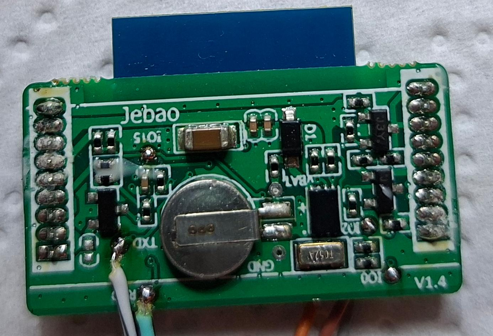
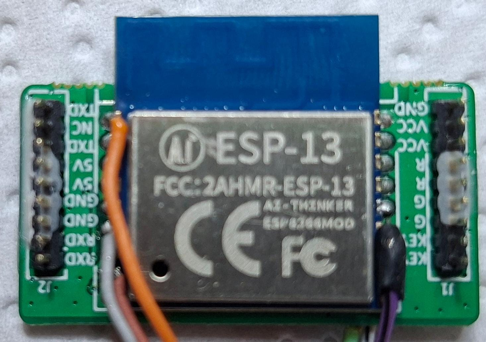

# ESPHome natively on Aqua Medic DC Runner x.3

**Flash on your own risc, but don't forget to back up the original firmware before flashing.**

I like the pump much more now ;)

## demo

## Current state of project

### What works

* all pump functions
* Wi-Fi status icon on monitor/controller shows the connection status
* **Error Detection (Er01 - Er05)** via UART bitmask analysis
  **Real-time Status Monitoring** including raw error codes
  **Note!** It seems the controller MCU does not throw the error and does not stop, if the pump runs dry.
  Most probably this is the issue of MCU, not of ESP8266 or ESPHome firmware.

### plans

* enable Wi-Fi AP mode via button on controller like original
    * alternatively WPS
* identify and implement hidden functionality:
  **issues are welcome**
* try to download / flash the original firmware without unmounting the glued Jebao v1.4 module

## Infos / reverse-engineering

### Hardware
- **Modul:** AI-Thinker ESP-13 (ESP8266EX, 4MB Flash)
- **UART to MCU:** GPIO1 (TXD), GPIO3 (RXD), 9600 bps
- **Programming-pins:** GPIO0 (Flash-Mode), GPIO15 (Boot)
- **power-supply:** 3.3V, GND

#### Jebao v1.4 module

---

---

## Protocol Specification: Aqua Medic DC Runner 3.3 (Jebao v1.4 / ESP8266 / ESP-13)

### 1. Physical Layer
*   **Interface:** UART (Serial)
*   **Baudrate:** 9600 bps
*   **Data Bits:** 8
*   **Stop Bits:** 1
*   **Parity:** None
*   **Logic Level:** 3.3V (ESP) / 5V (MCU) via J3Y (S8050) Transistors

---

### 2. Direction: ESP8266 → MCU (Control Commands)

The ESP8266 module sends these packets to the Motor-Mainboard.
**Standard Length:** 14 Bytes (Header + 11 Data + 1 Checksum)

| Byte Index | Function       |  Hex Value  | Description / Examples                          |
|:----------:|:---------------|:-----------:|:------------------------------------------------|
|    0, 1    | **Header**     |   `F5 0A`   | Fixed Start Sequence                            |
|     2      | **Length**     |    `0B`     | 11 Bytes following this byte                    |
|     3      | **Type**       |    `02`     | Command / Control Packet                        |
|     4      | **Power**      | `01` / `00` | **01**: Power ON, **00**: Power OFF             |
|     5      | **Feed**       | `01` / `00` | **01**: Feed/Pause ON, **00**: Normal Mode      |
|     6      | **Speed**      | `1E` - `64` | Power in % (e.g., 1E=30%, 64=100%)              |
|     7      | **Timer**      | `0A` - `3C` | Feed Duration (e.g., 0A=10min, 3C=60min)        |
|     8      | **Mode**       |    `00`     | Operation Mode (00: Constant Flow)              |
|     9      | **Wi-Fi Icon** | `00` - `02` | Display Icon (00: Off, 01: Blinking, 02: Solid) |
|     10     | **Night Mode** |    `1E`     | Night Speed Setting (default 30% / 1E)          |
|   11, 12   | **Reserved**   |   `00 00`   | Unknown / Fixed Padding                         |
|     13     | **Checksum**   |  Variable   | Sum of Bytes 2 through 12 (MOD 256)             |

#### Special Packets (ESP8266 → MCU)

| Packet (Hex)        | Name          | Function                                                       |
|:--------------------|:--------------|:---------------------------------------------------------------|
| `F5 0A 04 03 00 07` | **Init/Wake** | Sent once on boot or hardware reset                            |
| `F5 0A 04 01 00 05` | **Heartbeat** | Sent every 1s to get current state of pump/controller from MCU |

---

### 3. Direction: MCU → ESP8266 (Status Feedback)

The Mainboard mirrors the current state to the Wi-Fi module.
**Standard Length:** 14 Bytes (Header + 11 Data + 1 Checksum)

| Byte Index | Function       |  Hex Value  | Description                             |
|:----------:|:---------------|:-----------:|:----------------------------------------|
|    0, 1    | **Header**     |   `F5 0A`   | Start Sequence                          |
|     2      | **Length**     |    `0C`     | 12 Bytes following                      |
|     3      | **Type**       |    `01`     | Status Update                           |
|     4      | **Power**      | `01` / `00` | Current Power State                     |
|     5      | **Feed**       | `01` / `00` | Current Feed Mode State                 |
|     6      | **Speed**      | `1E` - `64` | Current Speed (from Controller Buttons) |
|     7      | **Timer**      | `0A` - `3C` | Current Timer setting                   |
|     8      | **Error Code** |   Bitmask   | **See Error Mapping Table below**       |
|   9 - 12   | **Data**       |  Variable   | Internal status / Padding               |
|     13     | **Checksum**   |  Variable   | Sum of Bytes 2 through 12               |

#### Error Mapping (Byte 8 Bitmask)

The controller uses a bitmask at Byte 8. Multiple errors can be reported simultaneously.

| Bit (Hex) |     Code     | Description                            | Verification Method            |
|:---------:|:------------:|:---------------------------------------|:-------------------------------|
| **0x01**  |   **Er01**   | Current consumption too high (Blocked) | Manual Blockage                |
| **0x02**  |   **Er02**   | Temperature too high                   | Manufacturer Spec              |
| **0x04**  |   **Er03**   | Pump runs dry                          | Dry run test                   |
| **0x10**  |   **Er04**   | Impeller blocked / Communication Loss  | Pump disconnected              |
| **0x08**  | **Er05** \** | **Power Loss / Low Voltage**           | **High-speed camera verified** |

> [!NOTE]
> **\**Er05 Discovery:** High-speed camera analysis of the controller display confirmed that the MCU triggers `Er05` (bit `0x08`) the moment the power supply is disconnected before the unit shuts down.

---

---

### 4. Logical Observations
*   **Wattage Display:** Although the controller display shows real-time wattage changes (e.g., dropping to 1W during dry run), indicating a physical shunt is present for internal monitoring, this data is **not** transmitted via the standard UART status packet (`0x0C`). The MCU seems to keep high-resolution power data internal or uses a different, yet unidentified, packet type.
*   **Error Handling:** The system relies on the MCU to trigger hardware protections. While the ESP8266 can monitor error bits, the "Hard-Off" (e.g., during dry run) is managed by the MCU's internal logic, which can take up to 2 minutes to trigger Er03.
*   **Checksum Calculation:** Simple 8-bit sum of all bytes starting from Length (Byte 2) up to the byte before the Checksum (Byte 13).
*   **Connectivity:** The Wi-Fi symbol on the controller display is passively controlled by the ESP8266 via Byte 9 in the heartbeat packet.

